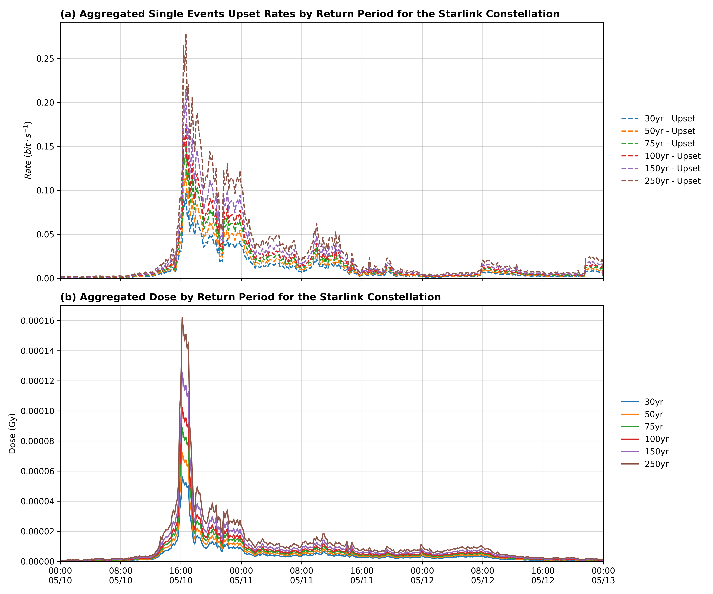

# Sensitivity Analysis of LEO Satellites to Space Weather Activities

## Overview

This project conducts a sensitivity analysis of LEO satellites under space weather events using three main modules. 
1. A radiation model estimates Single Event Effects (SEE) by fitting Weibull or triangular distributions to flux data from SOHO, ACE, and STEREO and computes dosimetry based on differential LET. It also implements a crude version of the CREME96 IRPP approach for radiation analysis. Magnetic rigidity and the impact of Earth's shadow are accounted for by scaling the differential fluxes with a simplified Stormer model. 
2. A network analysis then evaluates satellite coverage, network capacity degradation, and the cascading economic impacts of satellite failures. 
3. A satellite fleet analysis assesses atmospheric drag and propellant usage using the MSIS model and SGP4 propagation. 

Figure 1 below illustrates the methodological framework of the project.  

_Figure 1_

## Data Requirements

Historical TLE data, for example from the May 2024 Gannion storm, is obtained via the SpaceTrack API. Radiation data is sourced from ACE EPAM, STEREO A, and SOHO ERNE. Additionally, socioeconomic data from the Census Bureau at the ZCTA level and the 2022 Q3 BEA direct requirement matrix are used for economic analysis.

## Setup

First, create a `.env` file in the parent directory and add your SpaceTrack API credentials:

```env
SPACETRACK_USERNAME=<your_username>
SPACETRACK_PASSWORD=<your_password>
```

Next, edit the `config/settings.py` file to specify your desired constellations. The default configuration includes ONEWEB, KUIPER, TELESAT, and STARLINK.

## Execution Steps

### 1. Satellite Fleet and Drag Model

This step requires the `pymsis` library. First, download the TLE data by executing:

```bash
python satellite_fleet/download_tles.py
```

Then, propagate satellite positions using SGP4 at 5-minute intervals and compute drag estimates by running:

```bash
python satellite_fleet/drag_estimates.py
```

### 2. Radiation Model Processing

Prepare the SEE data and merge the flux datasets by executing:

```bash
python radiation_model/process_see_data.py
python radiation_model/see_rate.py
```

### 3. Network Analysis

The network analysis module extracts Uber H3 cells for the contiguous United States to support the capacity analysis model.

### 4. Capacity Degradation and Economic Analysis

The capacity degradation model estimates the reduction in network capacity based on failed satellites identified by the radiation model. It determines the Uber H3 cells served by the satellites and intersects the affected cells with socioeconomic data from the Census Bureau at the ZCTA level. An input-output model is then applied using the 2022 Q3 outputs and the BEA direct requirement matrix to derive the macroeconomic effects.

## Directory Structure

The project directory is organized as follows:

```
.
├── logs
├── viz
│   ├── figures
│   │   ├── epam_soho_stereo.png
│   │   ├── propellant_by_constellation.png
│   │   └── satellite_visibility.png
│   ├── __init__.py
│   ├── viz_econo.py
│   └── viz.py
├── config
│   ├── __init__.py
│   └── settings.py
├── network_analysis
│   ├── h3_grid.py
│   └── __init__.py
├── satellite_fleet
│   ├── download_tles.py
│   └── drag_estimates.py
├── capacity_analysis
│   ├── capacity_model.py
│   ├── coverage_estimator.py
│   ├── economic_impact.py
│   ├── __Init__.py
│   ├── io_model.py
│   └── monte_carlo_run.py
├── radiation_model
│   ├── de421.bsp
│   ├── let.py
│   └── process_see_data.py
└── data
```

## Final Model Outputs

**Network Capacity**

- Satellite coverage is modeled using a minimum elevation of 25° for antenna reception on the ground. For each LEO shell at distinct altitudes, the orbital position on the horizon defines the maximum coverage area for the gridded contiguous US polygon.
- The Uber H3 (hexagonal) grid model is applied to discretize the ground coverage of a single satellite beam. The contiguous United States is divided into resolution-5 hexagonal grids (~252 km² each; ~32,000 cells total) to ensure complete internet coverage.
- Satellites are propagated over a 3-day window at intervals of 20 minutes. The number of satellites located during these periods within the coverage area is recorded and averaged over all examined periods to obtain the number of required satellites to ensure uninterrupted service availability. Figure 2 below indicates the count of visible satellites within the contiguous US.
    
   _Figure 2_
- Assuming failures are uniformly distributed in space, the loss in coverage is estimated as:  
  Lost Satellites = (Min Satellites in Coverage / Total Satellites) × n_failures

The number of affected cells is estimated as:

Cells Affected = Lost Satellites × (32,000 / Satellites in Coverage)
Figures 3 and 4 below indicate the satellite coverage area within the US and zoomed-in H3 gridded regions, respectively.

  
 _Figure 3_
  
 _Figure 4_

**Radiation Outputs**

- Radiation data is sourced from three sensors operating in distinct regions of solar space: SOHO and ACE are positioned near the Sun–Earth Lagrange point L1, while STEREO A is operating in a heliocentric orbit.
- For the May 2024 Gannon storm (a 1-in-30-year event), differential fluxes recorded by these sensors are integrated to obtain the integral flux, which is then converted to stopping power assuming critical nodes are composed of silicon components. See Figure 5 for the observed energetic spectra by the three sensors at different channels during the Gannon storm.
    
  _Figure 5_
- A lognormal extrapolation is applied to extract extreme value statistics. The radiation model implements a variant of the CREME96 IRPP models. The upset rate is a function of particle path length, energy flux, stopping power, and material properties. A Monte Carlo simulation is adopted to test different sensitivities.
- Upset rates over the entire time series are converted via Poisson processes into the probability distributions of component failure per exposure. Moreover, the computed LET spectra is then applied to estimate the dose rates in J/kg. Figure 6 below indicates SEE and radiation dose rates.
    
   _Figure 6_

**Impact Analysis**

- A cumulative failure probability threshold, based on Poisson statistics, is applied in predicting the number of satellite failures under storm conditions.
- Failed satellites are mapped to affected H3 grid cells. With an estimated 2 million satellite users in the US, we approximate the affected population for _n_ satellite failures.
- The economic model assumes a loss of productivity for users relying on satellite internet connectivity. This is quantified by shocking the supply and demand tables from the BEA using input–output models to capture both the direct and indirect economic impacts, as shown in Figure 7.
    
   _Figure 7_
